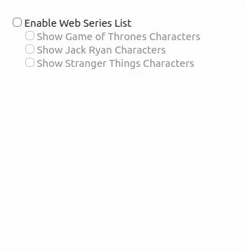
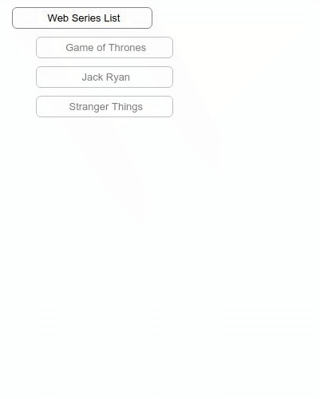

# react-list-hooks
React Components for handling item selection in a list. This is based on compound components pattern with hooks and context where state is implicitly handled.

## Demo
You can customize your list styling by your own. No need to worry about the state, that will be handled by **react-list-hooks**. 

Check box list             |  Button List             |
:-------------------------:|:-------------------------:
   |  

## Getting Started

### General prerequisites 
 * React 16.8+
 
### Installation
See [npm documentation](https://docs.npmjs.com/) on how to get started with npm.
```bash
npm install --save react-list-hooks
```
### Using
#### Basic usage example
Import into your React project and render a list:
```bash
import { ListContext, List, ListItem } from 'react-list-hooks';

const TextWithCheckBox = ({isSelected, id, displayValue, customClass}) => {
    const {updateList} = useContext(ListContext);
    return (
        <div className={customClass} onClick={() => updateList(id)}>
            <input type="checkbox" checked={isSelected} />
            <span>{displayValue}</span>
        </div>
    )
};

class App extends Component {
  render() {
    return (
      <List>
          <ListItem id={10}>
              <TextWithCheckBox displayValue={10} />
          </ListItem>
          <ListItem id={20}>
              <TextWithCheckBox displayValue={20} />
          </ListItem>
          <ListItem id={30}>
              <TextWithCheckBox displayValue={30} />
          </ListItem>
      </List>
    );
  }
}

export default App;
```


